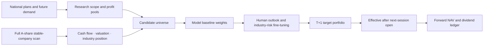

# A-Share Moat Value Strategy

**English: this page** · **中文：** [README.zh-CN.md](README.zh-CN.md)

<p align="center">
  
</p>

<p align="center"><strong>A research framework that keeps mechanical AI screening, human judgement and forward-looking NAV accounting separate.</strong></p>

<p align="center">
  <a href="https://ming-daily-portfolio.qianmin968641.chatgpt.site">Public read-only site</a> ·
  <a href="LICENSE">MIT License</a> ·
  <a href="SECURITY.md">Security</a>
</p>

> Research only. This is not investment advice, does not connect to a broker and never places orders automatically.

## What this project solves

The strategy does not pretend to know the future. It separates the decision into three layers:

1. **Model screening** — narrow the full A-share universe to candidates that pass valuation, cash-flow, industry-position and evidence checks.
2. **Human fine-tuning** — judge industry outlook, the probability of profit improvement and whether risks are already priced in; adjust weights only within the documented limits.
3. **Forward accounting** — a signal produced after today’s close becomes effective on the next trading day; today’s return always uses the portfolio published on the previous trading day.



The portfolio does not lower its standards just to stay fully invested. Cash is retained when there are not enough qualified names, evidence is incomplete or an industry limit has been reached.

## One-minute website guide

Open the [public site](https://ming-daily-portfolio.qianmin968641.chatgpt.site) for the latest published snapshot.

- **Today / daily return**: realized return for the latest completed session, calculated from the previous session’s published target portfolio.
- **Next execution**: the T+1 model target; reference close prices are not assumed fills. Unless actual fills are entered, the reproducible execution proxy is the next session’s open.
- **Actual fills**: enter execution price, quantity and fees. These values override the model proxy for the personal-account view and show unfilled or partially filled orders separately.
- **Portfolio report**: open all holdings and click a name to inspect its moat thesis, evidence status, DCF sensitivities, AI valuation review and public institution references.
- **Benchmark**: the chart compares the strategy with a CSI 300 raw-close proxy from the strategy start date. The benchmark is shown for every available range; missing benchmark dates are carried forward and labeled rather than silently dropped.
- **Guide and language**: click “使用说明” for the workflow guide and use the language link at the top of this README for the Chinese version.

## Core principles

### Screening is not the final decision

The scanner provides a conservative, repeatable baseline. It does not know whether a property cycle will recover, whether a future-demand story will be delivered or whether a temporary valuation premium is justified. Human judgement can fine-tune weights within the rules, but it cannot bypass evidence, risk limits or the T+1 accounting boundary.

### Moat evidence must be falsifiable

Company announcements, government sources and first-hand industry material with a date and traceable link are the only evidence allowed to change a moat status. Financial metrics can verify the economic outcome of a moat; they cannot turn a draft thesis into `INTACT` automatically.

The radar distinguishes data-access failure from a clean scan:

- `PENDING_REVIEW` pauses additional buying but never auto-writes the evidence ledger, sells, rebalances or places an order.
- `CAUTION` highlights what to watch and pauses additional buying.
- `CONTRADICTS` triggers `WEAKENED` and the reduction action configured in the thesis registry.
- A due review is shown as `REVIEW_DUE`; it is never silently postponed.
- `UNAVAILABLE`, `PARTIAL` and `OFFLINE` mean the announcement scan did not provide complete coverage. They must not be interpreted as “no risk found”.

### Evidence ladder

| Layer | What it can do | What it cannot do |
| --- | --- | --- |
| Model screening | Produce a baseline candidate and weight | Prove a moat or predict the future |
| Human review | Confirm whether the AI thesis fits the business and outlook | Rewrite dated source evidence |
| Public primary evidence | Change moat status when traceable and dated | Guarantee future returns |
| Financial outcomes | Validate economic results | Automatically promote a draft thesis |

The human-review boolean is informational and does not by itself set a holding weight to zero. A grey card means “not yet judged”; adverse future evidence creates alerts rather than pretending uncertainty is a fact.

### DCF sensitivity

The DCF has five discount-rate presets: very optimistic, optimistic, base, cautious and very cautious. They are valuation scenarios, not five independent forecasts. The selected sensitivity changes the discount rate and valuation reference; it does not override missing data or evidence rules.

### Forward NAV and dividends

- A target portfolio published after the close starts on the next trading day.
- Daily return uses raw close-to-close price changes plus the after-tax `cash_div` proxy and `stk_div` split ratio.
- Ex-rights date confirms the dividend entitlement; payment date turns it into cash pending reinvestment; the next trading day reinvests by target weight.
- Adjusted prices are not combined with separately added dividends, so distributions are not double counted.
- The CSI 300 comparison uses an original-close proxy and does not include dividends.

### Position sizing

Future-demand positions follow a two-way ladder: `OPTION_SEED` 2.5%, `CONFIRMED_BUILD` 5% after at least two milestone categories are verified, and `PROMOTED_CORE` 7.5% only after all three categories, no unresolved risk and a visible trend. Evidence deterioration steps the position down through the same ladder. A-share lot size is 100 shares; the minimum account-size check uses the most expensive one-share lot required by the target portfolio.

## Public website features

The site is a read-only presentation of the committed data snapshot. It includes:

- period returns and cumulative return;
- current prices, target weights and cash;
- daily, cumulative and strategy-versus-CSI-300 NAV curves;
- all available benchmark ranges and cumulative excess return;
- browser-local strategy start date;
- per-stock moat files and AI valuation review;
- first-open usage guide and bilingual labels;
- swipeable Today / Next Execution boards;
- local actual-fill overrides for price, quantity and fees.

## Repository layout

```text
config/                 Strategy, moat and future-milestone configuration
data/                   Local market and financial-data cache
memory/                 Durable project state and decisions
outputs/                Screening, radar, portfolio and NAV outputs
portfolio-site/         Read-only static website
scripts/                Refresh, screening and strategy entry points
valuation/              DCF and valuation helpers
docs/                   Method notes and visual assets
```

## Local setup

Requirements: Python 3.10+, Node.js/npm for the website, and a Tushare token available only through the local `.env` file. Never print, copy, commit or write the token into outputs or documentation.

```bash
cd /Users/ming/Desktop/workspace/a-share-cycle-rotation-strategy
python3 -m venv .venv
source .venv/bin/activate
pip install -r requirements.txt
```

Run the daily pipeline in this order, using only the latest completed trading day:

```bash
python3 scripts/refresh_rotation_market_data.py
python3 scripts/run_moat_radar.py
python3 scripts/run_future_demand_screen.py --refresh-financials
python3 scripts/run_barbell_strategy.py
```

Build the site:

```bash
cd portfolio-site
npm ci
npm run build
```

## Key files

- `config/portfolio-config.yaml` — strategy constraints and target weights.
- `config/moat-thesis-registry.csv` — dynamic moat theses and review dates.
- `config/moat-evidence-ledger.csv` — append-only dated evidence ledger.
- `config/future-milestones.csv` — milestone evidence; scripts must not mark rows `VERIFIED` without dated sources.
- `outputs/barbell-strategy/target_portfolio.csv` — the next-session model target.
- `outputs/barbell-strategy/portfolio_nav_history.csv` — forward daily NAV history.
- `outputs/barbell-strategy/portfolio_dividend_ledger.csv` — entitlement, cash and reinvestment ledger.
- `outputs/barbell-strategy/moat_radar_alerts.csv` and `moat_radar_health.csv` — radar events and coverage health.

## Tests and checks

```bash
python3 -m pytest -q
python3 -m compileall -q portfolio scripts valuation tests
python3 scripts/check_public_release.py
```

The release check rejects accidental tokens and validates the public snapshot before publication.

## Security, contributions and license

Keep credentials in local environment files only. Do not connect a broker or add order-placement code. Contributions should include a focused test or reproducible check and explain any change to accounting, evidence status or position limits. See [SECURITY.md](SECURITY.md) for reporting security issues. This project is released under the [MIT License](LICENSE).

## Disclaimer

This repository is for research and software demonstration. Data may be delayed, incomplete or unavailable; model prices are not execution promises; actual trading involves fees, liquidity, limits and slippage. Nothing here is investment advice or a recommendation to buy or sell any security.
