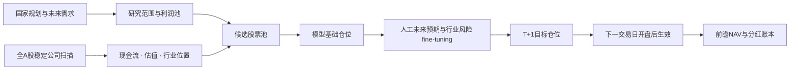
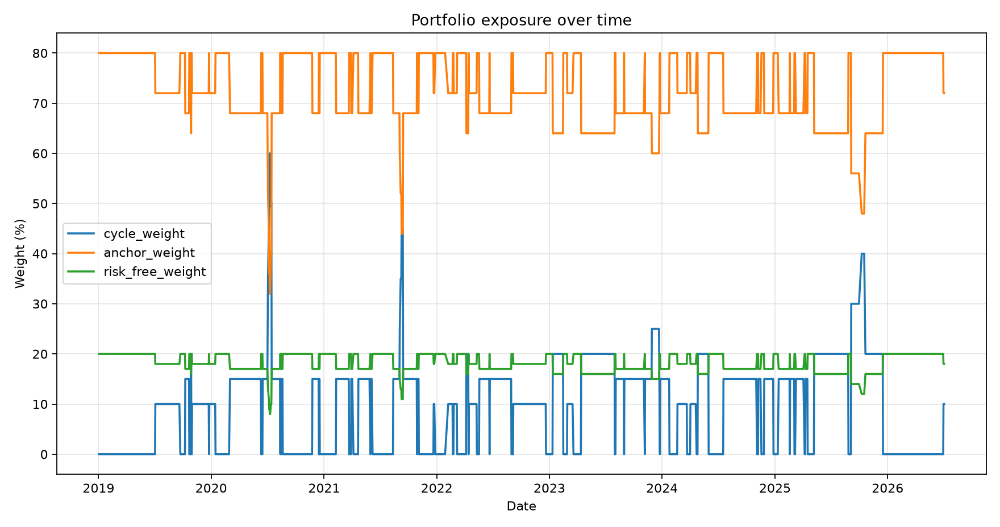

# A-Share Moat Value Strategy

<p align="center">
  
</p>

<p align="center"><strong>一个把 AI 机械筛选、人工未来判断与前瞻净值记账分开的 A 股研究框架。</strong></p>

<p align="center">
  <a href="https://ming-daily-portfolio.qianmin968641.chatgpt.site">公开只读网站</a> ·
  <a href="LICENSE">MIT License</a> ·
  <a href="SECURITY.md">安全说明</a>
</p>

> 研究项目，不构成投资建议，不连接券商，也不会自动下单。

## 这个项目解决什么问题

它不试图假装知道未来，而是把决策拆成三个层次：

1. **模型筛选**：从全 A 股缩小到估值、现金流、行业位置和证据门槛都合格的候选。
2. **人工 fine-tuning**：判断行业未来、利润改善概率和风险是否已经被价格反映，并在规则上限内调整仓位。
3. **前瞻记账**：当天收盘产生的信号只从下一交易日生效；今日收益永远使用上一交易日已经公布的仓位。



组合不为了满仓降低标准。没有足够合格标的、证据尚未完成或行业达到上限时，剩余资金保留为现金。

## 一分钟使用指南

打开[公开网站](https://ming-daily-portfolio.qianmin968641.chatgpt.site)后，先看顶部的“累计”和“今日收益”，再在右侧左右滑动比较“当日收益”和“明日执行”。点击个股可以打开护城河档案、DCF 五档敏感性、低估原因、估值修复条件和公开机构参考。

顶部的“使用说明 / Guide”会在首次访问时自动打开，也可以随时重新查看。实际成交入口只保存于当前浏览器：填写真实成交均价、数量和手续费后，才会计算个人实际权重和相对模型的滑点；它不会修改公共模型净值。

## 核心原则

### 1. 自动筛选不等于自动决策

系统负责缩小研究范围、检查数据完整性、记录首次失败的门槛，并生成待复核事项。最终的护城河证据判断仍需要人阅读公司公告、政府资料和行业一手数据。

### 2. 护城河是可被推翻的假设

每只持仓必须说明：

- 当前护城河机制；
- 为什么难以复制；
- 应持续观察什么；
- 哪些变化意味着护城河削弱；
- 下一次复核日期；
- 证据变化后应采取什么组合动作。

历史盈利能力只能验证护城河产生过经济结果，不能单独把公司判定为“护城河仍然稳固”。

### 3. 事件发现与护城河判断分离

`scripts/run_moat_radar.py` 检查：

- 公司公告标题中的监管、治理、经营和生存风险关键词；
- 同期季度收入、归母净利润和经营现金流的显著恶化；
- 定期护城河复核是否到期。

规则命中只会生成 `PENDING_REVIEW`。它不会自动写入证据台账、改变护城河状态、调整仓位或交易。接口无权限、断网、离线缓存和“成功扫描但无触发”会被记录为不同的健康状态。

### 4. 仓位随证据双向变化

| 状态 | 单股参考仓位 | 基本要求 |
| --- | ---: | --- |
| `RESEARCH_ONLY` | 0% | 只有研究价值，证据或估值门尚未通过 |
| `OPTION_SEED` | 2.5% | 未来逻辑、现金收益、估值、底部位置和最低证据门通过 |
| `CONFIRMED_BUILD` | 5% | 至少两类产业里程碑得到有日期的一手证据验证 |
| `PROMOTED_CORE` | 7.5% | 三类里程碑全部验证、无风险否决且趋势确认 |

证据恶化时按相同阶梯降低仓位，不允许用叙事跳级。

### 5. DCF使用五档折现率敏感性

保守DCF仍以 10% 折现率的基准档作为机械筛选门槛，同时输出每档移动 1 个百分点的五档估值：8%（非常乐观）、9%（乐观）、10%（基准）、11%（谨慎）和 12%（非常悲观）。五档使用相同的所有者收益、净现金和股本输入，不隐藏地改变盈利假设。

当前价格相对五档估值的安全边际会写入锚仓和未来产业筛选结果。基准档负责可重复的入选判断；乐观/悲观档用于识别“基准估值已贵但乐观情景仍有空间”和“价格便宜但悲观情景仍可能是价值陷阱”。个别公司若要采用非基准档，必须在研究记录中写明证据和理由，不能只因为价格上涨就上调估值。

锚仓的新进入必须通过基准 DCF 安全边际。已有锚仓如果基准估值略高、但乐观情景仍有支撑，会保留原仓位并暂停加仓；如果价格连续高于乐观情景，先预警一个交易日，再按 2.5 个百分点逐步减仓。估值本身不能直接把大于 2.5% 的锚仓清零。

### 6. AI仓位与人工护城河确认分离

AI先计算目标仓位，人工确认不参与仓位评分，也不会把未确认仓位自动降为 0%。`config/moat-human-review.csv` 用一个明确的 `confirmed` 布尔值记录人工判断：`false` 只表示“待观察”，不会阻止持仓、改变目标比例或从模型收益中剔除；`true` 表示人工已经完成记录。人工判断是后续预警和研究优先级的输入，不是持仓门槛；只有出现有日期、可追溯的不利一手证据，才生成雷达预警并进入人工复核。历史净值不因后续确认而回溯修改。

### 7. 只记录真实前瞻净值

公开组合从明确的起始日以单位净值 `1.0000` 开始。每个新交易日使用上一交易日已经公布的目标仓位计算收益；当天收盘后产生的新仓位只能从下一交易日起生效。

总回报包含原始收盘价变化、现金分红和送转股。现金分红在除权日确认权益、派息日进入待复投资金，并在下一记录日按目标权重统一复投。

## 公开网站

[护城河价值策略](https://ming-daily-portfolio.qianmin968641.chatgpt.site)

网站提供：

- Today、5日、1个月、6个月和1年单位净值收益；
- 当前价格、当日涨跌幅、目标仓位和现金比例；
- 含分红的真实前瞻净值曲线；
- 每位访问者浏览器本地保存的个人起始日；
- 每只持仓的动态护城河档案和待复核事件；
- 首次访问使用说明、调仓原因弹窗和中英文界面；
- 当日生效仓位与明日 T+1 目标的左右滑动对照；
- 模型信号与个人真实成交分离的成交记录区；
- 中文/英文切换与移动端适配。

网站源码目前作为独立项目维护，避免把部署凭据、构建依赖和策略数据缓存混入策略仓库。

> 网站展示的是公开只读模型快照。开盘代理价不保证成交，未成交或部分成交不会改写模型净值；护城河人工判断是观察与预警层，不是自动持仓否决。

## 项目结构

```text
config/                 研究假设、政策映射、里程碑和证据台账
data_loader/            Tushare与本地缓存读取
fundamental/            财务时点与生存能力检查
industry/               申万行业周期研究
portfolio/              哑铃组合、净值、分红和网站数据导出
selection/              未来产业、护城河证据与雷达规则
valuation/              所有者收益和保守估值
scripts/                日常刷新与策略入口
tests/                  当前规则的自动化测试
docs/                   方法说明与历史研究材料
```

`data/raw/`、`data/processed/`、`outputs/`、`.env` 和网站构建目录不会进入公开仓库。

## 本地运行

### 1. 创建环境

```bash
python3 -m venv .venv
source .venv/bin/activate
pip install -r requirements.txt
cp .env.example .env
```

需要在线获取数据时，在本地 `.env` 中填写：

```dotenv
TUSHARE_TOKEN=your_token_here
```

不要把真实Token提交到Git，也不要写入示例文件、Issue或日志。

### 2. 准备数据

本仓库不分发Tushare原始数据或完整财务缓存。第一次运行需要自行获取数据，或把已有缓存放入项目约定目录。

```bash
python3 scripts/refresh_rotation_market_data.py
python3 scripts/run_future_demand_screen.py --refresh-financials
```

不同Tushare接口可能需要独立权限。数据接口失败必须被视为“数据不可用”，不能解释为零值或没有风险。

### 3. 运行护城河雷达和组合

```bash
python3 scripts/run_moat_radar.py
python3 scripts/run_barbell_strategy.py
```

没有网络时可以使用已有缓存：

```bash
python3 scripts/run_moat_radar.py --offline
python3 scripts/run_barbell_strategy.py --offline
```

### 4. 运行测试

```bash
pytest
python3 scripts/check_public_release.py
```

## 主要配置与输出

| 文件 | 用途 |
| --- | --- |
| `config/barbell-policy.yaml` | 组合预算、单股上限和种子仓阶梯 |
| `config/future-thesis-registry.csv` | 未来产业假设 |
| `config/future-evidence-ledger.csv` | 未来产业一手证据台账 |
| `config/moat-thesis-registry.csv` | 持仓护城河假设和复核日期 |
| `config/moat-evidence-ledger.csv` | 护城河一手证据台账 |
| `config/moat-human-review.csv` | 人工护城河确认布尔值（`confirmed`） |
| `config/valuation-repair-briefs.json` | 估值低估原因、修复条件和公开机构参考链接 |
| `outputs/barbell-strategy/target_portfolio.csv` | 本地生成的目标组合 |
| `outputs/barbell-strategy/portfolio_nav_history.csv` | 本地前瞻净值历史 |
| `outputs/barbell-strategy/moat_radar_alerts.csv` | 本地待人工复核事件 |
| `outputs/barbell-strategy/moat_radar_health.csv` | 数据源健康状态 |

`outputs/` 默认不提交。公开展示组合时，应明确数据日期、计算口径和研究用途。

## 数据与安全

- Token只允许存在于本地环境变量或 `.env`；
- 不提交原始行情、财务缓存、个人投资记录或运行日志；
- 不把接口失败当成无风险信号；
- 不在代码、README、Issue、截图或Git历史中展示密钥；
- 公开前运行 `python3 scripts/check_public_release.py`；
- 网站只展示只读策略快照，不包含Token，也不连接个人电脑或券商账户。

## 关于历史回测代码

仓库保留了一部分早期周期轮动、CPPI和卖出制动研究代码，用于展示项目演化过程。早期回测曾存在时点边界和前视风险，现有结果没有完成独立的逐字段可得日审计，因此：

- 不把旧回测收益、Sharpe或最大回撤作为当前策略成绩；
- 不用旧回测决定当前公司是否入选；
- 不保证旧研究脚本可直接复现或适合实盘；
- 任何重新发布的回测都必须完成point-in-time数据审计、下一交易日执行、退市样本处理、交易成本和缺失数据检查。

详情见 [docs/LEGACY_RESEARCH_NOTICE.md](docs/LEGACY_RESEARCH_NOTICE.md)。

下面的图只用于说明早期研究代码曾经观察过的仓位与事件，不是当前前瞻组合的业绩承诺，也不是当前选股依据：

<p align="center">
  
</p>

<p align="center">
  
</p>

## 开源协作

欢迎提交：

- 一手护城河证据和反证；
- point-in-time数据处理修正；
- 估值、分红和组合记账测试；
- 数据源失败与权限状态处理；
- 无障碍和中英文界面改进。

请不要在Issue、Pull Request或示例文件中提交任何Token、账户信息或付费数据。

## License

MIT License。见 [LICENSE](LICENSE)。
