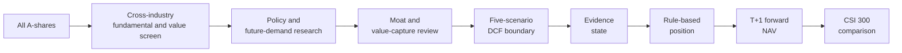
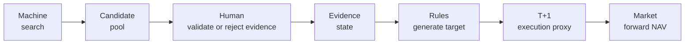
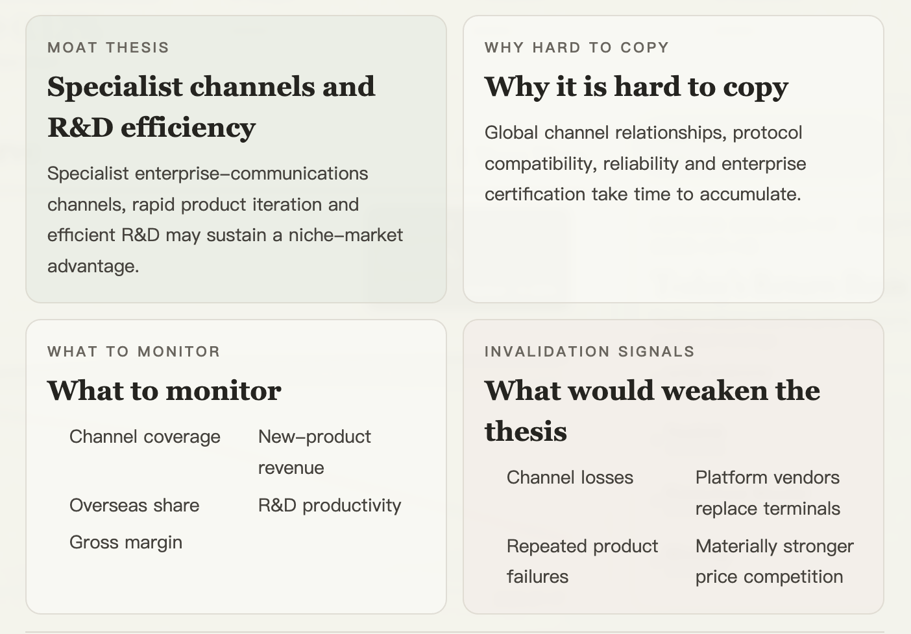
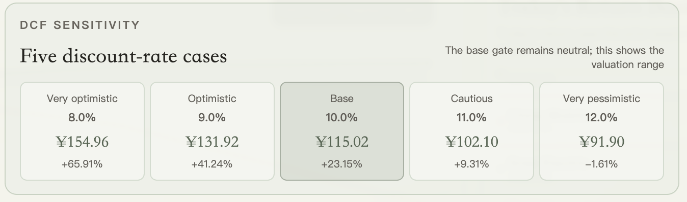
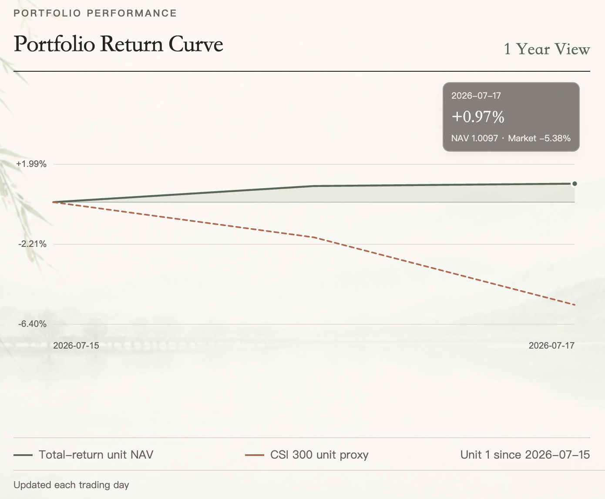
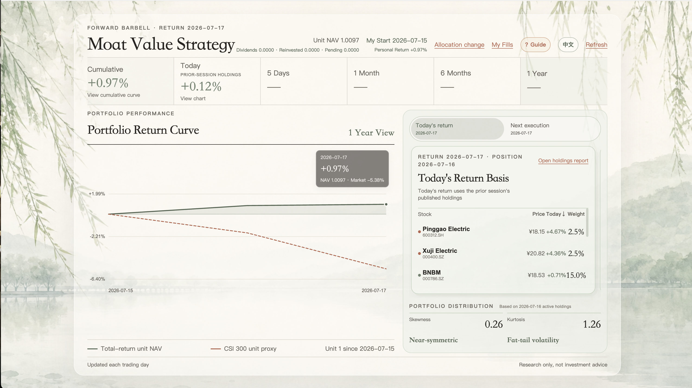
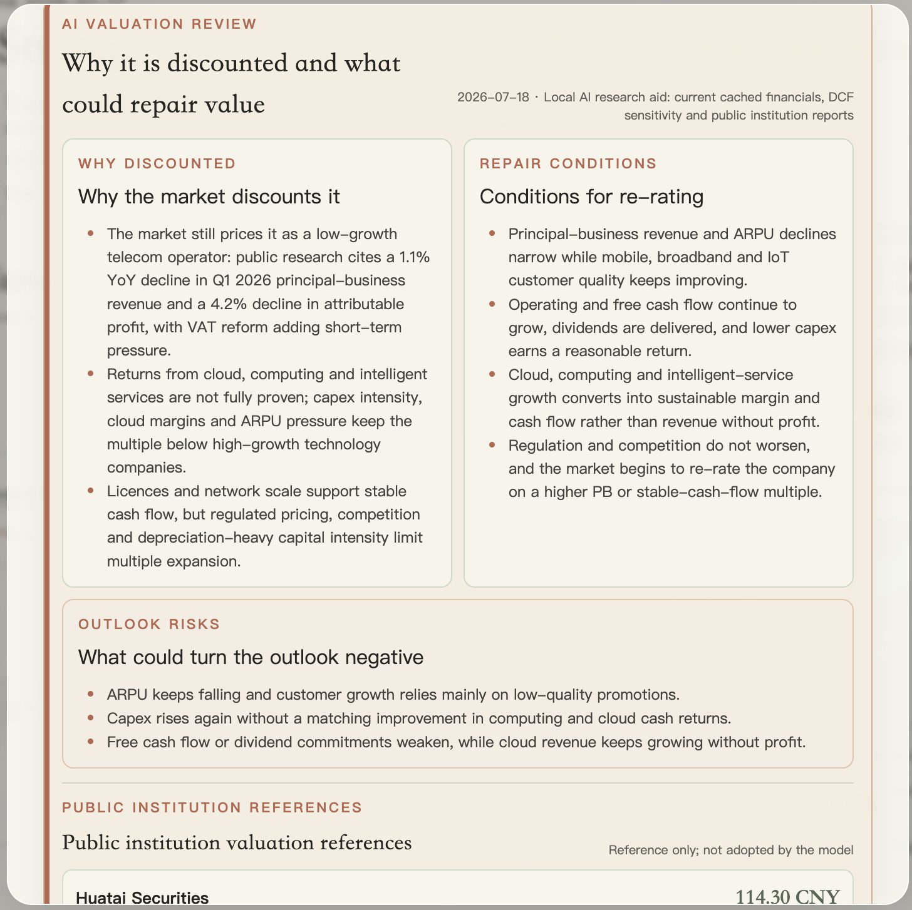
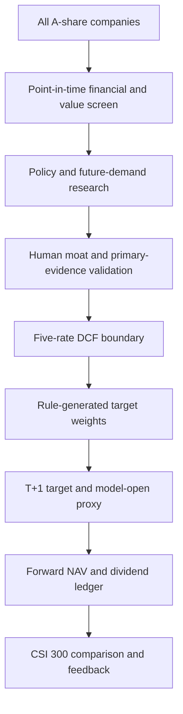

# A-Share Moat Value Strategy

**Machines search. Humans judge. Rules execute. Markets verify.**

A rule-based A-share investment research framework combining cross-industry undervaluation screening, future-demand research, falsifiable moat evidence, five-scenario DCF valuation, disciplined position management and real forward NAV tracking.

The project is deterministic Python plus human research records today. Optional LLM-assisted research is a future idea, not a runtime dependency.

**中文版本：** [README.zh-CN.md](README.zh-CN.md) · **Public site:** [ming-daily-portfolio.qianmin968641.chatgpt.site](https://ming-daily-portfolio.qianmin968641.chatgpt.site)

> **Research project only.** It does not connect to a broker or place orders.

## Project Status

This public documentation snapshot is dated **2026-07-17**, the latest completed trading day in the committed snapshot. It contains no credentials, private fills or browser-local account data.

- **Coverage:** 5,522 A-shares scanned; 202 securities passed financial review and had complete inputs for this snapshot.
- **Screening:** 15 companies passed the current defensive-anchor gates; the public research queue below shows 8 ranked rows.
- **Valuation:** 202 five-rate owner-earnings DCF records were generated.
- **Moat records:** 10 falsifiable moat registry records are maintained; a radar-health snapshot is available.
- **Forward verification:** the NAV record starts on 2026-07-15 and includes a raw-close CSI 300 comparison.
- **Public display:** the bilingual read-only website is available at the link above; these counts describe one snapshot, not a permanent coverage guarantee.

The aggregate counts are stored in [`docs/public-status.json`](docs/public-status.json), generated from the latest local barbell outputs by [`scripts/build_public_readme_snapshot.py`](scripts/build_public_readme_snapshot.py).

### Latest Screening Snapshot

The following queue is ranked by the implemented anchor score among the 202 financially reviewed rows in the snapshot. The base DCF margin is the model's `dcf_base_value_per_share / market close - 1` convention. The ranking prioritizes human research; it does not confirm a moat and is not an automatic buy signal.

**Snapshot date: 2026-07-17.** Full public fields are preserved in [`docs/public-screening-snapshot.csv`](docs/public-screening-snapshot.csv).

| Rank | Ticker | Company | Industry | Score | Base DCF margin | Financial/data gate | Screen status | Moat proxy status |
| ---: | --- | --- | --- | ---: | ---: | --- | --- | --- |
| 1 | `600519.SH` | 贵州茅台 | Food & beverage | 73.9 | -23.5% | `PASS_CASH_EARNINGS` | `WATCH` | `BRAND_PRICING_POWER_PROXY` |
| 2 | `002032.SZ` | 苏泊尔 | Household appliances | 73.4 | -6.9% | `PASS_CASH_EARNINGS` | `WATCH` | `SCALE_COST_LEADER_PROXY` |
| 3 | `000568.SZ` | 泸州老窖 | Food & beverage | 73.2 | +68.6% | `PASS_CASH_EARNINGS` | `WATCH` | `NO_POSITION_EVIDENCE` |
| 4 | `603195.SH` | 公牛集团 | Light manufacturing | 71.7 | -11.2% | `PASS_CASH_EARNINGS` | `WATCH` | `BRAND_PRICING_POWER_PROXY` |
| 5 | `002027.SZ` | 分众传媒 | Media | 71.7 | -3.6% | `PASS_CASH_EARNINGS` | `WATCH` | `POSITION_ONLY_REVIEW` |
| 6 | `000651.SZ` | 格力电器 | Household appliances | 71.6 | +113.3% | `PASS_CASH_EARNINGS` | `DEFENSIVE_ELIGIBLE` | `SCALE_COST_LEADER_PROXY` |
| 7 | `300760.SZ` | 迈瑞医疗 | Healthcare | 71.5 | -1.8% | `PASS_CASH_EARNINGS` | `WATCH` | `BRAND_PRICING_POWER_PROXY` |
| 8 | `300979.SZ` | 华利集团 | Textile manufacturing | 70.4 | +24.6% | `PASS_CASH_EARNINGS` | `WATCH` | `POSITION_ONLY_REVIEW` |

## How this system finds opportunities

The system does not start with a hot industry and then search for stocks, and it does not mechanically buy low-valuation companies. It intersects current valuation and financial quality with future-demand research to find companies whose expectations are low today while their future profit pool may improve.



The first leg searches for valuation support, owner earnings, cash-flow conversion, balance-sheet quality, survivability, data completeness and industry position across the full A-share universe. The second leg asks where policy, bottlenecks, demand and profit pools may improve. The intersection—not either leg alone—creates the research candidate pool.

## Why this project exists

Investment research needs consistency without pretending that uncertain futures are clean numbers. This framework makes the division of labour explicit:

- Machines process a broad market consistently and expose valuation, cash-flow and data-quality exceptions.
- Humans validate or reject uncertain future-demand and moat evidence, identify value traps and document the reason.
- Rules translate evidence states, valuation boundaries and portfolio limits into target weights.
- Forward market observations verify the complete process instead of selecting a flattering backtest after the fact.

The goal is an inspectable research process, not a promise to predict every price move.

## Machine, human, rules, market



| Layer | Current responsibility | Boundary |
| --- | --- | --- |
| **Machine — search** | Scan the universe, statements, valuation, cash flow, survival quality, industry position and evidence completeness. | Narrows the research universe; it does not prove a moat or forecast a company. |
| **Human — validate** | Judge future demand, policy relevance, industry risk and dated primary evidence; confirm or reject the thesis and record why. | Not unrestricted discretionary stock picking; later information cannot rewrite historical NAV. |
| **Rules — generate** | Convert validated evidence states, DCF boundaries and sleeve limits into anchor, future-option and cash weights. | Produces a model target and open-price proxy; it never sends a brokerage order. |
| **Market — verify** | Record forward daily NAV and compare it with a raw-close CSI 300 proxy. | The live sample is short and the benchmark excludes index dividends. |

## Core capabilities

### Cross-industry undervaluation plus future demand

The practical question is not “what is cheap?” or “what is fashionable?” It is whether a company has current cash-earnings support and a credible path to a better future profit pool. Policy documents, industrial planning, demand signals and milestone evidence define research directions; policy alignment alone is never a buy signal.

### Moat as value-capture analysis

Industry growth does not mean every participant benefits. Revenue growth or market share alone does not prove a durable moat. The moat file asks which company can capture and retain an expanding industry profit pool through pricing power, cost advantage, switching costs, network effects, scarce resources or licences, brand, channel, scale or institutional access. This separates general participants, temporary cycle beneficiaries and durable value capturers rather than simply selecting the largest company.

The registry and append-only evidence ledger record the mechanism, why it is hard to copy, dated traceable primary sources, observable indicators, invalidation signals, review dates and the configured portfolio action. Financial metrics test economic results; they do not automatically promote a `DRAFT` thesis to `INTACT`.

<p align="center"></p>

The moat view makes the thesis falsifiable: it states what is hard to copy, what should be monitored and what would weaken the evidence.

### Five-scenario DCF as a valuation boundary

DCF is not a precise target-price machine. It establishes pessimistic, cautious, base, optimistic and very optimistic boundaries so a reader can ask whether the base-case margin of safety exists, whether optimism is already priced in, whether apparent cheapness could be a value trap, and when adding, holding, pausing or reducing should be considered.

`valuation/owner_earnings.py` uses annual point-in-time statements, the median of the latest three owner-earnings observations, net cash, five forecast years and a terminal value. Growth is clipped to -2%–6%, terminal growth is 2.5%, and the base discount rate is 10%.

| Scenario | Discount rate |
| --- | ---: |
| `VERY_OPTIMISTIC` | 8% |
| `OPTIMISTIC` | 9% |
| `BASE` | 10% |
| `CAUTIOUS` | 11% |
| `VERY_PESSIMISTIC` | 12% |

The base case remains the repeatable screening gate; the other rates expose the valuation range without silently changing operating inputs.

<p align="center"></p>

The product view keeps the neutral 10% case as the mechanical gate while exposing the full 8%–12% range for a documented conviction review.

### Evidence radar

The radar is an evidence-monitoring system. Its automated layer checks held-company announcements, regulatory/governance/operating keywords, financial and cash-flow deterioration, scheduled review deadlines and data-source health. The human layer adds institutional research, government and industry materials, competitor changes, management disclosures, technology changes and the original moat thesis.

The radar finds events that may challenge the investment thesis; it does not decide their meaning. A hit becomes `PENDING_REVIEW`, while `OK`, `PARTIAL`, `UNAVAILABLE` and `OFFLINE` announcement coverage remain distinct health states. Outputs are `moat_radar_alerts.csv` and `moat_radar_health.csv`.

### Rule-based barbell positions

The current policy uses a 65% anchor budget, a 25% future-demand cap, a 15% single-theme cap, a 10% cash floor and a 15% anchor-name cap. Future evidence moves symmetrically through a ladder:

| State | Reference weight | Meaning |
| --- | ---: | --- |
| `RESEARCH_ONLY` | 0% | Candidate still in research. |
| `OPTION_SEED` | 2.5% | Evidence-backed future option with timing and valuation support. |
| `CONFIRMED_BUILD` | 5% | At least two milestone classes verified with dated evidence. |
| `PROMOTED_CORE` | 7.5% | Three milestone classes, no unresolved contradiction and trend confirmation. |

Cash is a valid output when evidence, valuation or diversification limits do not justify more exposure.

### Real forward NAV and execution boundary

1. A signal published after the close is a target for the next trading day.
2. Today’s return uses the target already published on the previous trading day.
3. The model open is a reproducible execution proxy, not a guaranteed fill. Visitor-local actual price, quantity and fee records are separate; unfilled and partial orders stay pending.
4. NAV uses raw close-to-close changes plus the after-tax `cash_div` proxy and `stk_div` split ratio. Entitlement is recognised on ex-date, cash becomes pending on pay-date, and the next session reinvests by target weight.
5. Adjusted prices are never combined with separate dividends, preventing double counting.
6. CSI 300 (`000300.SH`) uses an original-close price proxy, excludes index dividends and reports missing dates as `PARTIAL` or `UNAVAILABLE`.

<p align="center"></p>

The chart is a live forward record from the same unit start date, not a legacy backtest or a promise of persistent outperformance.

## Product screenshots and public website

Open the [read-only public site](https://ming-daily-portfolio.qianmin968641.chatgpt.site) to inspect the latest published snapshot. The separate `portfolio-site/` project presents model NAV, the current-return board, the next-session target board, full holdings, moat files, DCF sensitivity, valuation-repair summaries, curated public-institution references, radar health and browser-local actual-fill records. It never places a brokerage order.

<p align="center"></p>

The overview ties the research process to the product: cumulative and daily NAV, the current-return basis, the next-session board, holdings, distribution statistics and the CSI 300 comparison are visible in one place.

The valuation-repair view is a research aid rather than an automatic signal. It records why the market may discount a company, what could repair value, which factors could turn negative and how dated public institution references compare with the model.

<p align="center"></p>

The screenshots in this README are user-provided public-site captures from 2026-07-19. The actual-fill ledger is intentionally not shown because it contains visitor-local browser data.

Public institution references are curated/static inputs in `config/valuation-repair-briefs.json`; the website does not automatically search the web on every visit. The website source is an independent nested repository ignored by this root repository.

## End-to-end workflow



## Portfolio structure

- **Anchors:** durable current cash economics, industry position and moat proxies; 65% reference budget and 15% per-name cap.
- **Future options:** policy-linked demand and dated milestones; 2.5% → 5% → 7.5% ladder inside a 25% sleeve cap.
- **Cash:** at least 10% under the current policy, and more when evidence or valuation standards are not met.

## Human and machine responsibility boundary

| Responsibility | Machine | Human |
| --- | :---: | :---: |
| Scan financial data and calculate screening metrics | Yes | Review exceptions |
| Calculate owner-earnings DCF and sensitivities | Yes | Validate assumptions and context |
| Detect announcements and financial anomalies | Yes | Interpret significance and source quality |
| Map policy and future-demand questions | Support | Validate or reject the thesis |
| Organise moat evidence and review dates | Yes | Confirm, challenge or update the thesis |
| Generate model target weights | Yes | Use only documented overrides within policy |
| Execute brokerage trades | No | Outside project scope |
| Rewrite historical NAV with later information | No | No |

The current repository contains deterministic Python screening, financial processing, DCF, evidence/radar rules, positions, T+1 NAV and benchmark comparison, plus static configuration-backed research briefs. It does **not** contain a DeepSeek, OpenAI or other LLM API runtime. LLM evidence summarisation, report extraction and contradiction detection remain planned or optional future work.

## Quick start

Requirements: Python 3.10+, a local Tushare token, and Node.js/npm only if you build the separate website. Different Tushare endpoints may require different permissions.

```bash
git clone https://github.com/MIngQian04/a-share-moat-value-strategy.git
cd a-share-moat-value-strategy
python3 -m venv .venv
source .venv/bin/activate
pip install -r requirements.txt
cp .env.example .env
```

Put the token only in the local `.env`; never print, copy, commit or write it into outputs, screenshots or documentation.

```bash
python3 scripts/refresh_rotation_market_data.py
python3 scripts/run_moat_radar.py
python3 scripts/run_future_demand_screen.py --refresh-financials
python3 scripts/run_barbell_strategy.py
python3 scripts/build_public_readme_snapshot.py
```

When a source is unavailable, keep the cache and report unavailable data; do not convert missing data into zero risk or zero value. For cache-only checks:

```bash
python3 scripts/run_moat_radar.py --offline
python3 scripts/run_barbell_strategy.py --offline
```

Build the separate website with `cd portfolio-site && npm ci && npm run build`.

Run checks:

```bash
python3 -m pytest -q
python3 -m compileall -q portfolio scripts valuation tests
python3 scripts/check_public_release.py
```

## Repository structure

- `config/` — strategy assumptions, policy mapping, milestones and evidence ledgers.
- `data_loader/` — Tushare clients, local market cache, announcements and dividends.
- `fundamental/` — point-in-time statements and survival-quality inputs.
- `industry/` — industry-cycle and future-demand research.
- `selection/` — candidate pool, policy gates, moat evidence and radar rules.
- `valuation/` — owner-earnings normalisation and DCF valuation.
- `portfolio/` — position rules, dividend accounting, NAV and site export.
- `scripts/` — daily workflows and command-line entry points.
- `tests/` — automated tests for research, moat, portfolio and accounting rules.
- `docs/` — methodology, reproducibility notes and implementation boundaries.
- `portfolio-site/` — independent nested website repository, ignored by this root repository.

Raw caches, generated outputs, `.env` and website build artifacts are intentionally not part of the public root release.

## Methodology and documentation

Detailed implementation notes live in [docs/METHODOLOGY.md](docs/METHODOLOGY.md) · [中文方法说明](docs/METHODOLOGY.zh-CN.md): point-in-time data, the implemented owner-earnings DCF formulas, policy/future-demand research, falsifiable moat theses, evidence states, position transitions, T+1 execution, dividend accounting, benchmark construction, missing-data handling and reproducibility limits.

Further notes: [Architecture](docs/ARCHITECTURE.md) · [Runbook](docs/RUNBOOK.md) · [Future evidence workflow](docs/FUTURE_EVIDENCE_WORKFLOW.md) · [Legacy research notice](docs/LEGACY_RESEARCH_NOTICE.md) · [Reproducibility](docs/REPRODUCIBILITY.md).

## Roadmap

### Implemented

- Cross-industry screening with local-cache and Tushare data paths.
- Policy/future-demand mapping with evidence-gated position states.
- Moat thesis registry, append-only evidence ledger and radar health output.
- Five discount-rate DCF sensitivity around a 10% base case.
- Sticky anchors, staged future positions, cash floor and documented manual overrides.
- Forward NAV with T+1 targets, dividend ledger and raw-price accounting.
- CSI 300 price-proxy comparison and public snapshot export.
- Independent bilingual read-only website with local actual-fill tracking.

### In progress / partial

- Announcement coverage depends on Tushare `anns_d` permissions and network availability.
- Primary-source evidence and human moat confirmations still require manual research and ledger edits.
- Public institution references are curated configuration data, not an automatic web-research service.
- The forward record is young; longer sample-out-of-sample evaluation and transaction-cost analysis are not presented as complete.

### Future ideas

- LLM-assisted evidence summarisation with source citations and human approval.
- More redundant data providers and explicit factor/return attribution.
- Broader industry milestone tracking, multi-benchmark comparisons and a portfolio decision audit log.
- A reproducible, transaction-cost-aware rolling sample-out-of-sample study.

## Limitations and disclaimer

This is research software, not investment advice. It has no guaranteed return, no broker connection and no automatic live trading. Policy direction does not guarantee company profit; DCF values depend on assumptions; moat analysis can be wrong; public research can be incomplete or biased; Tushare endpoints can fail or require permissions; and the forward NAV history currently has a limited sample. The CSI 300 comparison is a raw-close price proxy rather than a total-return index. Liquidity, fees, lot size, taxes and execution slippage can make real results differ from both the model and any local actual-fill record.

## Security, contributions and license

Keep credentials in local environment files only. Do not add order-placement code or commit private data. Contributions should include a focused test or reproducible check and explain any change to accounting, evidence status or position limits. See [SECURITY.md](SECURITY.md) and [CONTRIBUTING.md](CONTRIBUTING.md). Licensed under the [MIT License](LICENSE).
