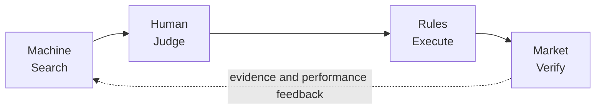
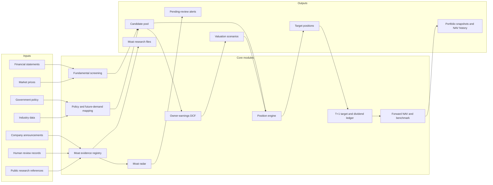
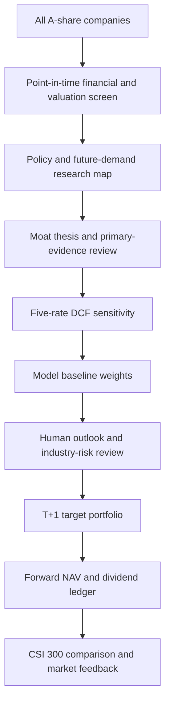

# A-Share Moat Value Strategy

**Machines search. Humans judge. Rules execute. Markets verify.**

An AI-assisted A-share investment research and decision framework combining cross-industry screening, policy and future-demand research, falsifiable moat evidence, five-scenario DCF valuation, rule-based position sizing and forward NAV accounting.

**中文版本：** [README.zh-CN.md](README.zh-CN.md) · **Public site:** [ming-daily-portfolio.qianmin968641.chatgpt.site](https://ming-daily-portfolio.qianmin968641.chatgpt.site)

<p align="center">
  
</p>

> **Research project only.** Not investment advice. The project does not connect to a broker, place orders or provide automatic live trading.

[MIT License](LICENSE) · [Security](SECURITY.md) · [Reproducibility notes](docs/REPRODUCIBILITY.md)

## Why this project exists

Investing is often pushed toward one of two extremes: discretionary stories that are difficult to reproduce, or automated models that treat uncertain qualitative evidence as if it were a clean number.

This project assigns each job to the tool best suited to it:

- Machines process a large A-share universe consistently and expose valuation, cash-flow and data-quality exceptions.
- Humans assess uncertain futures: industry cycles, policy implementation, profit-pool migration and whether a moat thesis still makes sense.
- Rules constrain position changes, evidence states and T+1 accounting so a persuasive narrative cannot silently become a trade.
- Market observations provide the forward record used to verify the whole decision process.

The goal is not to predict every price move. It is to make a conservative research process inspectable, reproducible and honest about what is still unknown.

## The four-layer decision framework



| Layer | Current responsibility | Explicit boundary |
| --- | --- | --- |
| **Machine — Search** | Scan the full market, statements, valuation, cash flow, survival quality, industry position and evidence completeness. | It narrows the research universe; it does not prove a moat or forecast a company’s future. |
| **Human — Judge** | Review future demand, policy context, industry risk and dated primary evidence; record a moat confirmation or concern. | Human review is not an unrestricted whole-market stock picker and does not rewrite historical NAV. |
| **Rules — Execute** | Convert screened candidates and evidence states into anchor/future/cash weights, staged changes and T+1 target positions. | It produces a model target and execution proxy; it never sends a brokerage order. |
| **Market — Verify** | Record forward daily NAV and compare it with a CSI 300 raw-close proxy. | The sample is short and the benchmark is a price-index proxy, not a guaranteed excess-return claim. |

## System architecture



Public institutional research and news are research inputs for human review. They are not an automatic signal source and do not by themselves change a position. See [docs/ARCHITECTURE.md](docs/ARCHITECTURE.md) for module boundaries and [docs/METHODOLOGY.md](docs/METHODOLOGY.md) for calculations.

## Core capabilities

### Cross-industry fundamental screening

The current pipeline works from a Tushare-backed A-share universe and local caches. It combines valuation, owner earnings, cash-flow conversion, financial quality, survival checks, industry position and data completeness. Anchor candidates have explicit limits for leverage, valuation multiples, positive operating history, ROE, margin stability, industry concentration and missing financial data.

The output is a candidate pool and an auditable reason for each inclusion or exclusion—not a promise that every passing company should be bought.

### Policy and future-demand mapping

National plans and industrial material define research directions, potential profit pools and milestone questions. The policy gate requires a national-plan source and a traceable government URL; policy alignment is a research-universe filter, not a direct stock-return predictor.

Future candidates are scored on demand certainty, bottleneck strength, value capture, exposure confidence, competition risk and substitution risk. A high score is research priority, not a buy signal, and the scripts never mark `config/future-milestones.csv` as `VERIFIED` without dated evidence.

### Economic moat evidence system

Each moat thesis is intended to describe a durable, difficult-to-replicate advantage—such as pricing power, cost advantage, network effects, switching costs, scarce licences/resources, brand, channel, scale or institutional access—and the cash-flow or return-on-capital outcomes it should produce.

The registry and append-only evidence ledger track the mechanism, why it is difficult to copy, dated traceable primary sources, observable indicators, invalidation conditions, next review date and the configured action if evidence weakens. Financial metrics can validate economic results; they cannot automatically promote a `DRAFT` thesis to `INTACT`.

### Five-scenario DCF valuation

`valuation/owner_earnings.py` builds owner earnings from annual point-in-time statements, uses the median of the latest three observations, adds net cash and values five forecast years plus a terminal value. Growth is capped between -2% and 6%; the base discount rate is 10% and terminal growth is 2.5%.

| Scenario | Discount rate |
| --- | ---: |
| `VERY_OPTIMISTIC` | 8% |
| `OPTIMISTIC` | 9% |
| `BASE` | 10% |
| `CAUTIOUS` | 11% |
| `VERY_PESSIMISTIC` | 12% |

The base case is the repeatable screening gate. The other cases show how margin of safety changes when the required return moves; they do not secretly change the operating forecast.

### Moat radar

`scripts/run_moat_radar.py` checks held companies for announcement keywords covering regulatory, governance, operating and survival risks, same-period financial deterioration and overdue review dates. It writes `moat_radar_alerts.csv` and `moat_radar_health.csv`.

Every hit is `PENDING_REVIEW`. The radar does not write the evidence ledger, silently classify a thesis, sell, reduce, rebalance or place an order. `OK`, `PARTIAL`, `UNAVAILABLE` and `OFFLINE` announcement coverage are distinct health states; incomplete access is never reported as “no risk”. The moat monitor uses `REVIEW_DUE`, `WEAKENED`, `WATCH`, `INTACT` and `DRAFT`.

### Rule-based position management

The barbell policy keeps a stable anchor budget, a capped future-demand budget and an explicit cash floor. Existing anchor positions are sticky; ordinary daily score differences do not force a full replacement. New or reduced positions move through documented steps.

| State | Reference weight | Meaning in the current policy |
| --- | ---: | --- |
| `RESEARCH_ONLY` | 0% allocation | A research candidate that has not passed the required gates. |
| `OPTION_SEED` | 2.5% | A valuation-supported future option with seed evidence and timing gates. |
| `CONFIRMED_BUILD` | 5% | At least two milestone classes are verified with the required evidence. |
| `PROMOTED_CORE` | 7.5% | Three milestone classes, no unresolved invalidation and trend confirmation. |

The current configuration caps future positions at 25% in total, a single theme at 15%, keeps a 10% cash floor and caps an anchor name at 15%. These are policy references, not guarantees about every snapshot. Evidence deterioration moves a future position down the same ladder; an invalidated thesis is not an allocation state.

### Real forward NAV

1. A signal published after the close becomes a target for the next trading day.
2. Today’s return uses the target portfolio already published on the previous trading day.
3. Model reference prices are not assumed fills. The website can store visitor-local actual price, quantity and fee overrides; unfilled and partial orders remain pending and do not rewrite model NAV.
4. NAV uses raw close-to-close changes plus the after-tax `cash_div` proxy and `stk_div` split ratio. Ex-rights confirms entitlement, payment creates pending cash, and the next session reinvests by target weight.
5. Adjusted prices are not combined with separate dividends, preventing double counting.
6. The CSI 300 (`000300.SH`) comparison uses an original-close proxy, excludes index dividends and reports missing dates as `PARTIAL` or `UNAVAILABLE` rather than fabricating values.

## End-to-end workflow



## Portfolio design

The portfolio is a barbell rather than a forced full-investment ranking:

- **Anchor:** conservative, cash-generative companies with valuation and industry limits; the configured anchor budget is 65% and the per-name cap is 15%.
- **Future options:** a capped 25% budget for evidence-backed future-demand candidates, staged at 2.5%, 5% and 7.5% as evidence and milestones accumulate.
- **Cash:** at least 10% under the current policy, and potentially more when the screen, evidence or industry caps do not justify additional exposure.

Cash is a valid output. It is the accounting result of refusing to lower valuation, evidence or risk standards merely to remain invested.

## Human–AI responsibility boundary

| Responsibility | Machine | Human |
| --- | :---: | :---: |
| Scan financial data and calculate screening metrics | Yes | Review exceptions |
| Calculate owner-earnings DCF and sensitivities | Yes | Validate assumptions and context |
| Detect announcements and financial anomalies | Yes | Interpret significance and source quality |
| Map policy and future-demand questions | Support | Decide whether the thesis is credible |
| Organise moat evidence and review dates | Yes | Confirm, challenge or update the thesis |
| Generate model target weights | Yes | Fine-tune only through documented overrides |
| Execute brokerage trades | No | Outside project scope |
| Rewrite historical NAV with later information | No | No |

The repository contains a deterministic Python research pipeline and static, configuration-backed “local AI research aid” briefs. It does **not** contain a DeepSeek/OpenAI/other LLM API runtime. Model-assisted evidence summarisation is a future idea, not a current capability.

## Public website

Open the [read-only public site](https://ming-daily-portfolio.qianmin968641.chatgpt.site) for the latest published snapshot. The separate `portfolio-site/` repository presents daily/cumulative/period NAV views, Today versus Next Execution boards, full holdings, per-stock moat files, DCF sensitivity, valuation-repair briefs, curated public-institution references, moat radar health, local actual-fill records, bilingual labels and a first-open usage guide.

Public institutional references are curated/static inputs in `config/valuation-repair-briefs.json`; the site does not automatically search the web on every visit. The website source is an independent nested repository ignored by the root repository.

<p align="center"></p>
<p align="center"></p>

These are repository snapshots for orientation, not a promise that the displayed dates are current. Dedicated screenshots for the moat detail dialog, radar-health panel and actual-fill ledger are not yet stored under `docs/assets/`.

## Quick start

Requirements: Python 3.10+, a local Tushare token, and Node.js/npm only if you build the separate website. Different Tushare endpoints may require different permissions.

```bash
cd /Users/ming/Desktop/workspace/a-share-cycle-rotation-strategy
python3 -m venv .venv
source .venv/bin/activate
pip install -r requirements.txt
cp .env.example .env
```

Put the token only in the local `.env`; never print, copy, commit or write it into outputs, screenshots or documentation.

```bash
python3 scripts/refresh_rotation_market_data.py
python3 scripts/run_moat_radar.py
python3 scripts/run_future_demand_screen.py --refresh-financials
python3 scripts/run_barbell_strategy.py
```

When a source is unavailable, keep the cache and report unavailable data; do not convert missing data into zero risk or zero value. For cache-only checks:

```bash
python3 scripts/run_moat_radar.py --offline
python3 scripts/run_barbell_strategy.py --offline
```

Build the separate website with `cd portfolio-site && npm ci && npm run build`.

Run checks:

```bash
python3 -m pytest -q
python3 -m compileall -q portfolio scripts valuation tests
python3 scripts/check_public_release.py
```

## Repository structure

- `config/` — strategy assumptions, policy mapping, milestones and evidence ledgers.
- `data_loader/` — Tushare clients, local market cache, announcements and dividends.
- `fundamental/` — point-in-time statements and survival-quality inputs.
- `industry/` — industry-cycle and future-demand research.
- `selection/` — candidate pool, policy gates, moat evidence and radar rules.
- `valuation/` — owner-earnings normalisation and DCF valuation.
- `portfolio/` — position rules, dividend accounting, NAV and site export.
- `scripts/` — daily workflows and command-line entry points.
- `tests/` — automated tests for research, moat, portfolio and accounting rules.
- `docs/` — methodology, reproducibility notes, diagrams and snapshots.
- `portfolio-site/` — independent nested website repository, ignored by this root repository.

Raw caches, generated outputs, `.env` and website build artifacts are intentionally not part of the public root release.

## Methodology and documentation

Detailed implementation notes live in [docs/METHODOLOGY.md](docs/METHODOLOGY.md): point-in-time data, valuation, policy/future-demand research, falsifiable moat theses, evidence states, position transitions, T+1 execution, dividend accounting, benchmark construction, missing-data handling and reproducibility limits.

Further notes: [Architecture](docs/ARCHITECTURE.md) · [Runbook](docs/RUNBOOK.md) · [Future evidence workflow](docs/FUTURE_EVIDENCE_WORKFLOW.md) · [Legacy research notice](docs/LEGACY_RESEARCH_NOTICE.md) · [Reproducibility](docs/REPRODUCIBILITY.md).

## Roadmap

### Implemented

- Cross-industry screening with local-cache and Tushare data paths.
- Policy/future-demand mapping with evidence-gated position states.
- Moat thesis registry, append-only evidence ledger and radar health output.
- Five discount-rate DCF sensitivity around a 10% base case.
- Sticky anchors, staged future positions, cash floor and documented manual overrides.
- Forward NAV with T+1 targets, dividend ledger and raw-price accounting.
- CSI 300 price-proxy comparison and public snapshot export.
- Independent bilingual read-only website with local actual-fill tracking.

### In progress / partial

- Announcement coverage depends on Tushare `anns_d` permissions and network availability.
- Primary-source evidence and human moat confirmations still require manual research and ledger edits.
- Public institution references are curated configuration data, not an automatic web-research service.
- The forward record is young; longer sample-out-of-sample evaluation and transaction-cost analysis are not presented as complete.

### Future ideas

- LLM-assisted evidence summarisation with source citations and human approval.
- More redundant data providers and explicit factor/return attribution.
- Broader industry milestone tracking, multi-benchmark comparisons and a portfolio decision audit log.
- A reproducible, transaction-cost-aware rolling sample-out-of-sample study.

## Limitations and disclaimer

This is research software, not investment advice. It has no guaranteed return, no broker connection and no automatic live trading. Policy direction does not guarantee company profit; DCF values depend on assumptions; moat analysis can be wrong; public research can be incomplete or biased; Tushare endpoints can fail or require permissions; and the forward NAV history currently has a limited sample. The CSI 300 comparison is a raw-close price proxy rather than a total-return index. Liquidity, fees, lot size, taxes and execution slippage can make real results differ from both the model and any local actual-fill record.

## Security, contributions and license

Keep credentials in local environment files only. Do not add order-placement code or commit private data. Contributions should include a focused test or reproducible check and explain any change to accounting, evidence status or position limits. See [SECURITY.md](SECURITY.md) and [CONTRIBUTING.md](CONTRIBUTING.md). Licensed under the [MIT License](LICENSE).
