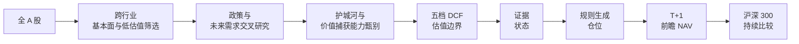
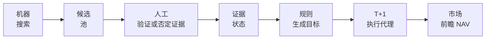
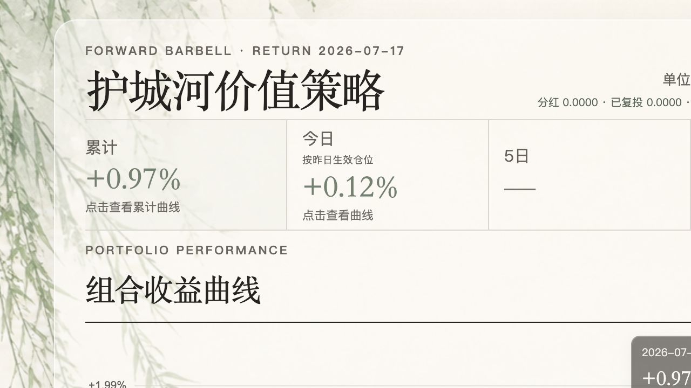
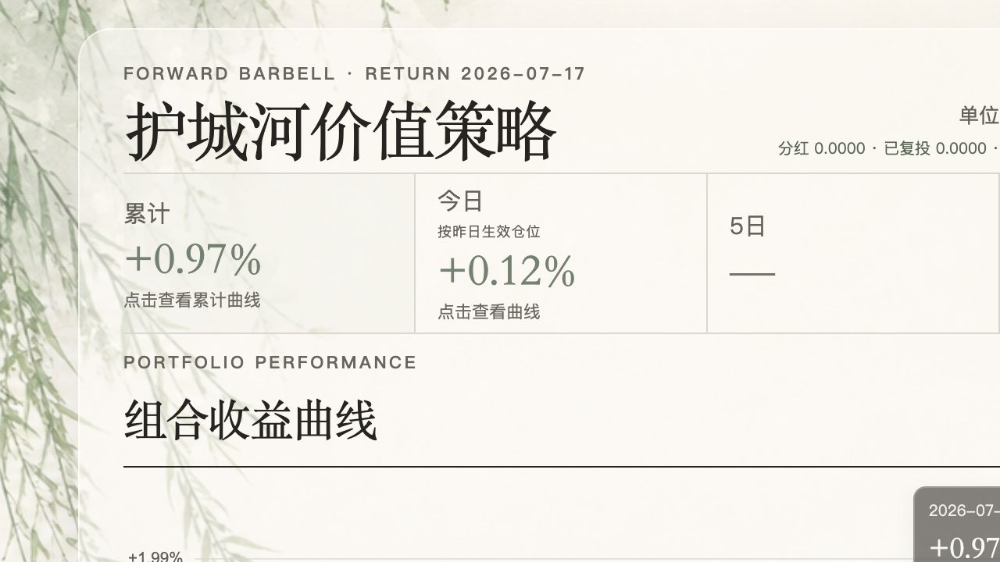
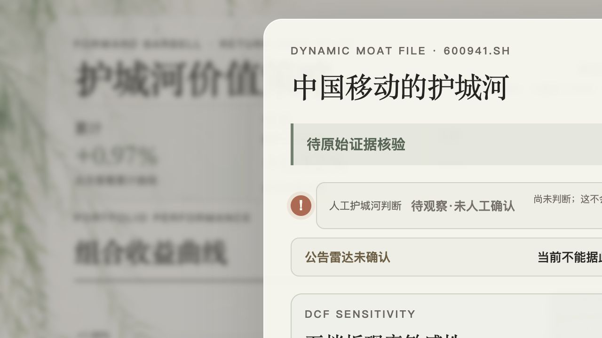
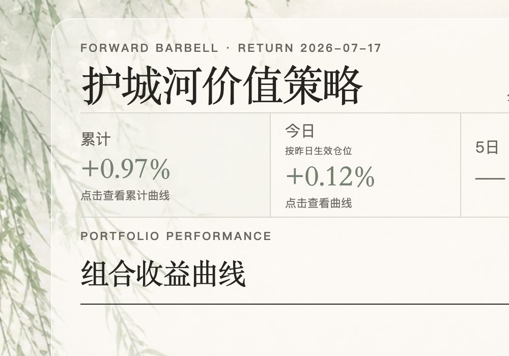
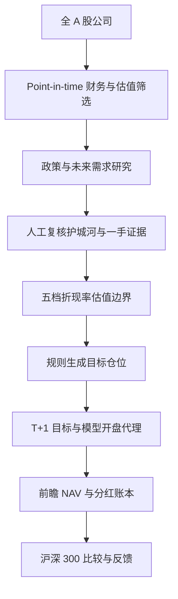

# A 股护城河价值策略

**机器负责搜索，人工负责判断，规则负责执行，市场负责验证。**

一个将跨行业低估值筛选、未来需求研究、可证伪护城河证据、五档 DCF 估值、规则化仓位管理和真实前瞻 NAV 结合起来的 A 股投资研究框架。

仓库当前是确定性的 Python 流水线与人工研究记录；LLM 辅助研究属于未来设想，不是运行时依赖。

**English:** [README.md](README.md) · **公开网站：** [ming-daily-portfolio.qianmin968641.chatgpt.site](https://ming-daily-portfolio.qianmin968641.chatgpt.site)

> **仅供研究。** 不连接券商，不自动下单。

## 这个系统如何寻找机会

系统不是先指定热门行业再寻找股票，也不是只根据低估值机械买入，而是将跨行业估值筛选与未来需求研究交叉，寻找当前预期较低、但未来利润池可能改善的公司。



第一条腿从全 A 股寻找估值支持、所有者收益、现金流转化、资产负债表质量、生存能力、数据完整性和行业位置；第二条腿研究政策、产业规划、需求、瓶颈和利润池变化。候选池来自两者的交叉，而不是其中任何一项单独通过。

## 为什么做这个项目

投资研究既需要机器的一致性，也需要人对不确定未来的判断。本项目把责任拆开：

- 机器一致处理宽广的 A 股市场，暴露估值、现金流和数据质量异常。
- 人工验证或否定未来需求与护城河证据，识别价值陷阱并记录理由。
- 规则把证据状态、估值边界和组合限制转成目标仓位。
- 前瞻市场观察验证完整过程，而不是事后挑选漂亮的回测区间。

目标是让研究流程可检查、可复现，并清楚标出仍然未知的部分。

## 机器、人工、规则与市场



| 层次 | 当前职责 | 边界 |
| --- | --- | --- |
| **机器：搜索** | 扫描全市场、报表、估值、现金流、生存质量、行业位置和证据完整性。 | 缩小研究范围，但不能证明护城河或预测公司未来。 |
| **人工：验证** | 判断未来需求、政策相关性、行业风险和有日期的一手证据，确认或否定假设并记录理由。 | 不是无边界的主观选股；后来信息不能回写历史 NAV。 |
| **规则：生成** | 把证据状态、DCF 边界和仓位上限转成锚仓、未来期权和现金权重。 | 只产生模型目标与开盘代理价，不发送券商订单。 |
| **市场：验证** | 记录前瞻日 NAV，并与沪深 300 原始收盘价代理比较。 | 实盘样本仍短，基准不含指数分红。 |

## 核心能力

### 跨行业低估值与未来需求交叉

实际问题不是“什么便宜”或“什么热门”，而是公司是否有当前现金收益支撑，以及未来利润池是否存在可信的改善路径。政策文件、产业规划、需求信号和里程碑证据用于定义研究方向；政策匹配本身不是买入信号。

### 护城河识别价值捕获能力

行业景气只能说明利润池可能扩大，不能说明所有公司都会受益。收入增长或市场份额也不能单独证明持久护城河。护城河档案要回答：谁能够通过定价权、成本优势、转换成本、网络效应、稀缺资源或牌照、品牌、渠道、规模或制度性优势，持续获取并保留行业利润。这样才能区分一般参与者、阶段性受益者和真正的长期价值捕获者，而不是只挑最大的公司。

注册表与 append-only 证据台账记录经济机制、难以复制的原因、有日期且可追溯的一手来源、观察指标、反证信号、复核日期和证据恶化时的组合动作。财务指标只验证经济结果，不能自动把 `DRAFT` 提升为 `INTACT`。

### 五档 DCF 是估值边界，不是精准目标价

DCF 在本项目中不是为了给出一个看似精准的目标价，而是建立非常悲观、谨慎、基准、乐观和非常乐观的估值边界。它帮助判断基准安全边际是否存在、乐观情景是否已经被价格透支、便宜是否可能是价值陷阱，以及何时应考虑加仓、持有、暂停或减仓。

`valuation/owner_earnings.py` 使用年度 point-in-time 报表、最近三期所有者收益中位数、净现金、五年预测和终值。增长率限制在 -2% 至 6%，终值增长率为 2.5%，基准折现率为 10%。

| 情景 | 折现率 |
| --- | ---: |
| `VERY_OPTIMISTIC` 非常乐观 | 8% |
| `OPTIMISTIC` 乐观 | 9% |
| `BASE` 基准 | 10% |
| `CAUTIOUS` 谨慎 | 11% |
| `VERY_PESSIMISTIC` 非常悲观 | 12% |

基准档仍是可重复的筛选门槛；其余档位展示估值区间，不暗中改变经营预测。

### 护城河雷达是证据监测系统

雷达的自动层检查持仓公告、监管/治理/经营关键词、财务与经营现金流恶化、定期复核到期和数据源健康；人工层补充机构研报、政府与行业资料、竞争对手变化、管理层披露、技术变化以及原始护城河假设。

雷达负责发现可能挑战投资逻辑的事件，不负责解释事件含义。命中生成 `PENDING_REVIEW`；公告覆盖的 `OK`、`PARTIAL`、`UNAVAILABLE`、`OFFLINE` 保持不同健康状态。输出文件为 `moat_radar_alerts.csv` 和 `moat_radar_health.csv`。

### 规则化哑铃仓位

当前政策使用 65% 锚仓预算、25% 未来产业总上限、15% 单一主题上限、10% 现金底线和 15% 锚仓单股上限。未来证据按同一阶梯升降：

| 状态 | 参考仓位 | 含义 |
| --- | ---: | --- |
| `RESEARCH_ONLY` | 0% | 仍在研究的候选。 |
| `OPTION_SEED` | 2.5% | 有证据、估值和时机支持的未来期权。 |
| `CONFIRMED_BUILD` | 5% | 至少两类里程碑以有日期证据验证。 |
| `PROMOTED_CORE` | 7.5% | 三类里程碑、无未解决反证且趋势确认。 |

当证据、估值或分散限制不足以支持更多暴露时，现金就是有效输出。

### 真实前瞻 NAV 与成交边界

1. 收盘后发布的信号只成为下一交易日目标。
2. 今日收益使用上一交易日已经公布的目标仓位。
3. 模型开盘价是可复现的执行代理，不保证成交。访问者本地的实际价格、数量和手续费单独记录；未成交与部分成交保持待执行。
4. NAV 使用原始收盘价涨跌，加税后代理 `cash_div` 与 `stk_div` 送转比例。除权日确认权益，派息日形成待复投资金，下一交易日按目标权重统一复投。
5. 不把复权价与单独分红同时使用，避免重复计算。
6. 沪深 300（`000300.SH`）使用原始收盘价代理，不含指数分红；缺失日期显示 `PARTIAL` 或 `UNAVAILABLE`，不编造数据。

## 公开网站与产品截图

打开[公开只读网站](https://ming-daily-portfolio.qianmin968641.chatgpt.site)查看最新发布快照。独立的 `portfolio-site/` 项目展示模型 NAV、当日收益板、明日目标板、完整持仓、个股护城河档案、DCF 敏感性、估值修复摘要、配置中的公开机构参考、雷达健康和浏览器本地实际成交记录；它不会连接券商或自动下单。

<table>
  <tr>
    <td width="50%"></td>
    <td width="50%"></td>
  </tr>
  <tr>
    <td width="50%"></td>
    <td width="50%"></td>
  </tr>
</table>

以上图片于 2026-07-19 从公开只读网站真实截取。仓库不再把旧项目回测图表当作当前表现证据；上面四张是产品功能视图。由于公开页面将当日/明日板放在响应式侧栏中，没有加入单独、完整的横向仓位板裁剪图；公开网站链接仍是该功能的权威入口。实际成交账本依赖访问者本地浏览器数据，因此没有加入专门的成交账本截图。

公开机构参考来自 `config/valuation-repair-briefs.json` 的静态/人工整理内容；网站不会每次访问都自动联网搜索。网站源码是独立嵌套仓库，根仓库通过 `.gitignore` 排除。

## 端到端流程



## 组合结构

- **锚仓：** 当前现金经济、行业位置和护城河代理较稳定；锚仓预算 65%，单股上限 15%。
- **未来期权：** 政策关联需求与有日期里程碑；在 25% 总上限内按 2.5% → 5% → 7.5% 阶梯建设。
- **现金：** 当前政策至少 10%；当证据或估值标准未满足时，现金可以更高。

## 人工与机器责任边界

| 工作 | 机器 | 人工 |
| --- | :---: | :---: |
| 扫描财务数据并计算筛选指标 | 是 | 复核异常 |
| 计算所有者收益 DCF 与敏感性 | 是 | 验证假设与背景 |
| 检测公告与财务异常 | 是 | 判断重要性与来源质量 |
| 提出政策与未来需求问题 | 辅助 | 验证或否定假设 |
| 整理护城河证据与复核日期 | 是 | 确认、质疑或更新假设 |
| 生成模型目标仓位 | 是 | 只能在规则内使用文档化覆盖 |
| 执行券商交易 | 否 | 不在项目范围内 |
| 用后来信息改写历史 NAV | 否 | 不允许 |

仓库当前实现的是确定性的 Python 筛选、财务处理、DCF、证据/雷达规则、仓位、T+1 NAV 和基准比较，以及配置驱动的静态研究摘要。**没有** DeepSeek、OpenAI 或其他 LLM API 运行时；LLM 证据总结、研报提取和反证检测仍是未来或可选能力。

## 快速开始

需要 Python 3.10+、本地 Tushare Token；只有构建独立网站时才需要 Node.js/npm。不同 Tushare 接口可能需要不同权限。

```bash
cd /Users/ming/Desktop/workspace/a-share-cycle-rotation-strategy
python3 -m venv .venv
source .venv/bin/activate
pip install -r requirements.txt
cp .env.example .env
```

Token 只能写入本地 `.env`，绝不打印、复制、提交或写入输出、截图和文档。

```bash
python3 scripts/refresh_rotation_market_data.py
python3 scripts/run_moat_radar.py
python3 scripts/run_future_demand_screen.py --refresh-financials
python3 scripts/run_barbell_strategy.py
```

数据源不可用时保留缓存并报告不可用，不把缺失数据变成零风险或零价值。只使用缓存检查时：

```bash
python3 scripts/run_moat_radar.py --offline
python3 scripts/run_barbell_strategy.py --offline
```

构建独立网站：`cd portfolio-site && npm ci && npm run build`。

运行检查：

```bash
python3 -m pytest -q
python3 -m compileall -q portfolio scripts valuation tests
python3 scripts/check_public_release.py
```

## 仓库结构

- `config/`：策略假设、政策映射、里程碑与证据台账。
- `data_loader/`：Tushare 客户端、本地行情缓存、公告和分红。
- `fundamental/`：Point-in-time 财务与生存质量输入。
- `industry/`：行业周期与未来需求研究。
- `selection/`：候选池、政策门槛、护城河证据和雷达规则。
- `valuation/`：所有者收益归一化与 DCF 估值。
- `portfolio/`：仓位规则、分红记账、NAV 和网站导出。
- `scripts/`：日常流程与命令行入口。
- `tests/`：研究、护城河、组合和记账规则测试。
- `docs/`：方法、可复现说明和实现边界。
- `portfolio-site/`：独立嵌套网站仓库，根仓库忽略。

原始缓存、生成输出、`.env` 和网站构建产物不会进入根仓库公开版本。

## 方法与文档

详细实现见 [docs/METHODOLOGY.md](docs/METHODOLOGY.md)，涵盖 point-in-time 数据、估值、政策/未来需求研究、可证伪护城河、证据状态、仓位变化、T+1、分红账本、基准构造、缺失数据和可复现边界。

更多资料：[架构](docs/ARCHITECTURE.md) · [运行手册](docs/RUNBOOK.md) · [未来证据流程](docs/FUTURE_EVIDENCE_WORKFLOW.md) · [历史研究说明](docs/LEGACY_RESEARCH_NOTICE.md) · [可复现说明](docs/REPRODUCIBILITY.md)。

## 路线图

### 已实现

- 带本地缓存和 Tushare 数据路径的跨行业筛选。
- 带证据门槛的政策/未来需求映射与仓位状态。
- 护城河注册表、append-only 证据台账与雷达健康输出。
- 以 10% 为基准的五档折现率 DCF 敏感性。
- 黏性锚仓、未来仓阶梯、现金底线和文档化人工覆盖。
- 带 T+1 目标、分红账本和原始价格记账的前瞻 NAV。
- 沪深 300 价格代理比较和公开快照导出。
- 独立双语只读网站与本地实际成交记录。

### 进行中/部分实现

- 公告覆盖取决于 Tushare `anns_d` 权限和网络可用性。
- 一手证据与人工护城河确认仍需人工研究和台账维护。
- 机构估值参考是配置中的人工整理资料，不是自动联网研报服务。
- 前瞻记录仍较短；尚未把更长样本外检验和交易成本分析宣称为完成。

### 未来设想

- 带来源引用和人工批准的 LLM 辅助证据总结。
- 更多数据源冗余、因子/收益归因。
- 更完整的行业里程碑、多基准比较和组合决策审计日志。
- 可复现、含交易成本的滚动样本外检验。

## 局限与免责声明

这是研究软件，不构成投资建议；没有保证收益、券商连接或自动实盘交易。政策方向不保证公司利润，DCF 依赖假设，护城河判断可能错误，公开研报可能不完整或有偏差，Tushare 接口可能失败或需要权限，前瞻 NAV 样本目前有限。沪深 300 对比是原始收盘价代理而非全收益指数。流动性、手续费、最小交易单位、税费和实际滑点都可能让真实结果不同于模型或本地成交记录。

## 安全、协作与许可证

凭据只保存在本地环境文件中；不要添加下单代码或提交私人数据。贡献应包含聚焦测试或可复现检查，并说明对记账、证据状态或仓位上限的影响。见 [SECURITY.md](SECURITY.md) 与 [CONTRIBUTING.md](CONTRIBUTING.md)。项目采用 [MIT License](LICENSE)。
