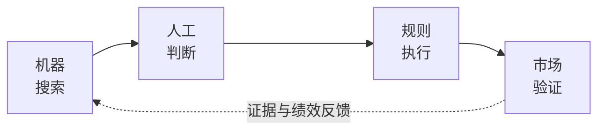
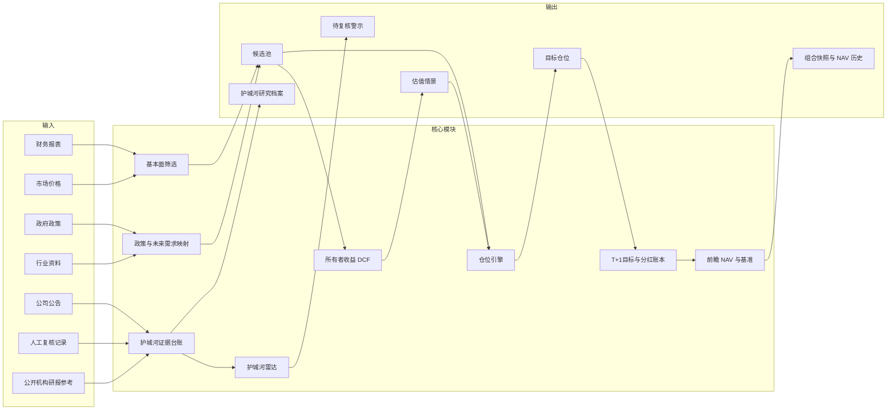
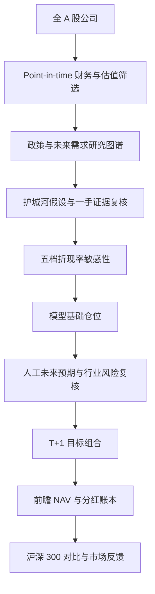
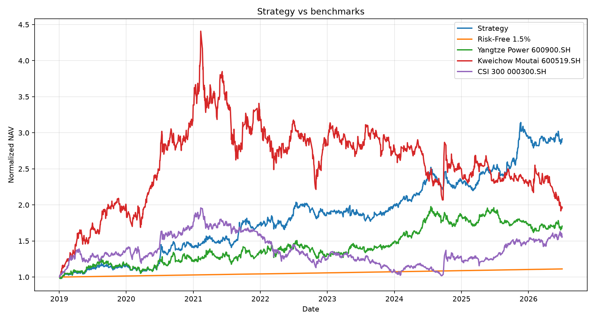
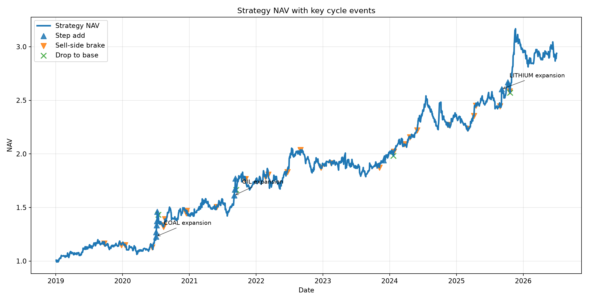

# A 股护城河价值策略

**机器负责搜索，人工负责判断，规则负责执行，市场负责验证。**

这是一个 AI 辅助的 A 股投资研究与决策框架，把跨行业筛选、政策与未来需求研究、可证伪的护城河证据、五档 DCF 估值、规则化仓位管理和前瞻 NAV 记账连接起来。

**English:** [README.md](README.md) · **公开网站：** [ming-daily-portfolio.qianmin968641.chatgpt.site](https://ming-daily-portfolio.qianmin968641.chatgpt.site)

<p align="center">
  
</p>

> **仅供研究。** 不构成投资建议；不连接券商，不自动下单，也不提供自动实盘交易。

[MIT License](LICENSE) · [安全说明](SECURITY.md) · [可复现说明](docs/REPRODUCIBILITY.md)

## 为什么做这个项目

投资经常在两个极端之间摆动：依靠难以复现的主观故事，或者把不确定的定性证据强行变成模型数字。

本项目把工作分给更适合的角色：

- 机器一致地处理全 A 股，暴露估值、现金流和数据质量异常。
- 人工判断行业周期、政策落地、利润池迁移，以及护城河假设是否仍然成立。
- 规则约束调仓、证据状态和 T+1 记账，防止叙事直接变成交易。
- 市场记录前瞻净值，用来验证整个决策流程，而不是事后挑选漂亮的历史区间。

目标不是预测每一次价格波动，而是让保守的研究流程可检查、可复现，并诚实地标出未知部分。

## 四层决策框架



| 层次 | 当前职责 | 明确边界 |
| --- | --- | --- |
| **机器：搜索** | 扫描全市场、财务报表、估值、现金流、生存质量、行业位置和证据完整性。 | 缩小研究范围，但不能证明护城河，也不能预测公司未来。 |
| **人工：判断** | 复核未来需求、政策背景、行业风险和有日期的一手证据，记录护城河确认或疑虑。 | 不是无边界的人工选股，也不能回写历史 NAV。 |
| **规则：执行** | 把候选和证据状态转成锚仓/未来/现金权重、阶梯式变动和 T+1 目标仓位。 | 只产生模型目标与执行代理价，不发送券商订单。 |
| **市场：验证** | 记录前瞻日 NAV，并与沪深 300 原始收盘价代理对比。 | 样本仍短，基准是价格指数代理，不代表保证超额收益。 |

## 系统架构



公开机构研报和新闻只是供人工判断的研究输入，不是自动信号，也不会单独改变仓位。模块边界见 [docs/ARCHITECTURE.md](docs/ARCHITECTURE.md)，计算细节见 [docs/METHODOLOGY.md](docs/METHODOLOGY.md)。

## 核心能力

### 跨行业基本面筛选

当前流水线使用 Tushare 与本地缓存构建 A 股候选池，综合估值、所有者收益、现金流转化、财务质量、生存能力、行业位置和数据完整性。锚仓候选还有杠杆、估值倍数、盈利历史、ROE、毛利率稳定性、行业集中度和财务数据缺失限制。

输出是候选池和可追溯的入选/淘汰原因，不是“通过即应买入”的承诺。

### 政策与未来需求映射

国家规划和产业一手材料用于定义研究方向、潜在利润池与里程碑问题。政策门槛要求国家规划来源和可追溯政府网址；政策匹配是研究范围过滤器，不是股票收益预测器。

未来候选按需求确定性、瓶颈强度、价值捕获、公司暴露可信度、竞争风险和替代风险评分。高分只表示研究优先级；脚本不会在没有有日期证据时把 `config/future-milestones.csv` 标为 `VERIFIED`。

### 经济护城河证据系统

每份护城河假设都应说明持久且难以复制的优势，例如定价权、成本优势、网络效应、转换成本、稀缺牌照/资源、品牌、渠道、规模或制度性优势，以及这些优势应产生的现金流或资本回报结果。

注册表与 append-only 证据台账记录机制、难以复制的原因、有日期且可追溯的一手来源、观察指标、反证条件、下次复核日期和证据恶化时的组合动作。财务指标可以验证经济结果，不能自动把 `DRAFT` 提升为 `INTACT`。

### 五档 DCF 估值

`valuation/owner_earnings.py` 从年度 point-in-time 报表计算所有者收益，取最近三期中位数，加净现金，计算五年预测与终值。增长率限制在 -2% 至 6%，基准折现率为 10%，终值增长率为 2.5%。

| 情景 | 折现率 |
| --- | ---: |
| `VERY_OPTIMISTIC` 非常乐观 | 8% |
| `OPTIMISTIC` 乐观 | 9% |
| `BASE` 基准 | 10% |
| `CAUTIOUS` 谨慎 | 11% |
| `VERY_PESSIMISTIC` 非常悲观 | 12% |

基准档是可重复的筛选门槛；其余情景展示要求回报变化时安全边际如何变化，不暗中改变经营预测。

### 护城河雷达

`scripts/run_moat_radar.py` 检查持仓公司公告中的监管、治理、经营和生存风险关键词，同期财务显著恶化，以及定期复核是否到期，并输出 `moat_radar_alerts.csv` 和 `moat_radar_health.csv`。

命中只生成 `PENDING_REVIEW`。雷达不会写入证据台账、静默改变护城河状态、卖出、减仓、调仓或下单。公告覆盖的 `OK`、`PARTIAL`、`UNAVAILABLE`、`OFFLINE` 是不同健康状态；数据不完整不能解释为“没有风险”。护城河监测状态包括 `REVIEW_DUE`、`WEAKENED`、`WATCH`、`INTACT` 和 `DRAFT`。

### 规则化仓位管理

哑铃政策保留锚仓预算、受上限约束的未来产业预算和现金底线。已有锚仓具有黏性，不会因为日常评分小差异就强制全量替换；新增和降低都按文档化阶梯执行。

| 状态 | 参考仓位 | 当前政策含义 |
| --- | ---: | --- |
| `RESEARCH_ONLY` | 0%配置 | 研究候选尚未通过必要门槛。 |
| `OPTION_SEED` | 2.5% | 通过种子证据、估值和时机门槛的未来期权。 |
| `CONFIRMED_BUILD` | 5% | 至少两类里程碑以所需证据验证。 |
| `PROMOTED_CORE` | 7.5% | 三类里程碑、无未解决反证且趋势确认。 |

当前配置将未来产业总仓位限制在 25%，单一主题 15%，现金底线 10%，锚仓单股上限 15%。这些是政策参考，不代表每个历史快照都相同；证据恶化按同一阶梯降仓，`INVALIDATED` 不是配置状态。

### 真实前瞻 NAV

1. 收盘后发布的信号只成为下一交易日的目标。
2. 今日收益使用上一交易日已经公布的目标仓位。
3. 模型参考价不视为成交价。网站可以在访问者本地记录真实成交价、数量和手续费；未成交/部分成交保持待执行，不改写模型 NAV。
4. NAV 使用原始收盘价涨跌，加税后代理 `cash_div` 与 `stk_div` 送转比例。除权日确认权益，派息日形成待复投资金，下一交易日按目标权重统一复投。
5. 不把复权价与单独分红同时使用，避免重复计算。
6. 沪深 300（`000300.SH`）使用原始收盘价代理，不含指数分红；缺失日期显示为 `PARTIAL` 或 `UNAVAILABLE`，不编造数据。

## 端到端流程



## 组合设计

组合是哑铃结构，而不是强制满仓排名：

- **锚仓：** 有现金流、估值和行业限制的稳定公司；当前配置锚仓预算 65%，单股上限 15%。
- **未来期权：** 受 25% 总上限约束，随证据和里程碑按 2.5%、5%、7.5% 阶梯建设。
- **现金：** 当前政策至少 10%；当合格标的、证据或行业上限不足时，现金可以更高。

现金是有效输出，代表不为了保持满仓而降低估值、证据或风险标准。

## 人工与 AI 的责任边界

| 工作 | 机器 | 人工 |
| --- | :---: | :---: |
| 扫描财务数据并计算筛选指标 | 是 | 复核异常 |
| 计算所有者收益 DCF 与敏感性 | 是 | 验证假设与背景 |
| 检测公告与财务异常 | 是 | 判断重要性与来源质量 |
| 提出政策与未来需求问题 | 辅助 | 判断假设是否可信 |
| 整理护城河证据与复核日期 | 是 | 确认、质疑或更新假设 |
| 生成模型目标仓位 | 是 | 只能通过文档化覆盖微调 |
| 执行券商交易 | 否 | 不在项目范围内 |
| 用后来信息改写历史 NAV | 否 | 否 |

仓库当前是确定性的 Python 研究流水线，并带有配置驱动的“本地 AI 研究辅助”摘要；**没有** DeepSeek、OpenAI 或其他 LLM API 运行时。模型辅助证据总结属于未来计划，不是当前能力。

## 公开网站

打开[公开只读网站](https://ming-daily-portfolio.qianmin968641.chatgpt.site)查看最新发布快照。独立的 `portfolio-site/` 项目目前展示：日/累计/区间 NAV、当日与明日执行板、完整持仓、个股护城河档案、DCF 敏感性、估值修复摘要、配置中的公开机构参考、雷达健康状态、本地实际成交记录、中英文界面和首次使用说明。

公开机构参考来自 `config/valuation-repair-briefs.json` 的静态/人工整理内容；网站不会每次访问都自动联网搜索。网站源码是独立嵌套仓库，根仓库通过 `.gitignore` 排除。

<p align="center"></p>
<p align="center"></p>

以上是仓库快照，仅用于了解界面，不保证日期仍是最新。`docs/assets/` 目前还没有护城河详情、雷达健康和实际成交账本的专门截图。

## 快速开始

需要 Python 3.10+、本地 Tushare Token；只有构建独立网站时才需要 Node.js/npm。不同 Tushare 接口可能需要不同权限。

```bash
cd /Users/ming/Desktop/workspace/a-share-cycle-rotation-strategy
python3 -m venv .venv
source .venv/bin/activate
pip install -r requirements.txt
cp .env.example .env
```

Token 只能写入本地 `.env`，绝不打印、复制、提交或写入输出、截图和文档。

```bash
python3 scripts/refresh_rotation_market_data.py
python3 scripts/run_moat_radar.py
python3 scripts/run_future_demand_screen.py --refresh-financials
python3 scripts/run_barbell_strategy.py
```

数据源不可用时保留缓存并报告不可用，不把缺失数据变成零风险或零价值。只使用缓存检查时：

```bash
python3 scripts/run_moat_radar.py --offline
python3 scripts/run_barbell_strategy.py --offline
```

构建独立网站：`cd portfolio-site && npm ci && npm run build`。

运行检查：

```bash
python3 -m pytest -q
python3 -m compileall -q portfolio scripts valuation tests
python3 scripts/check_public_release.py
```

## 仓库结构

- `config/`：策略假设、政策映射、里程碑与证据台账。
- `data_loader/`：Tushare 客户端、本地行情缓存、公告和分红。
- `fundamental/`：Point-in-time 财务与生存质量输入。
- `industry/`：行业周期与未来需求研究。
- `selection/`：候选池、政策门槛、护城河证据和雷达规则。
- `valuation/`：所有者收益归一化与 DCF 估值。
- `portfolio/`：仓位规则、分红记账、NAV 和网站导出。
- `scripts/`：日常流程与命令行入口。
- `tests/`：研究、护城河、组合和记账规则测试。
- `docs/`：方法、可复现说明、图表和快照。
- `portfolio-site/`：独立嵌套网站仓库，根仓库忽略。

原始缓存、生成输出、`.env` 和网站构建产物不会进入根仓库公开版本。

## 方法与文档

详细实现见 [docs/METHODOLOGY.md](docs/METHODOLOGY.md)，涵盖 point-in-time 数据、估值、政策/未来需求研究、可证伪护城河、证据状态、仓位变化、T+1、分红账本、基准构造、缺失数据和可复现边界。

更多资料：[架构](docs/ARCHITECTURE.md) · [运行手册](docs/RUNBOOK.md) · [未来证据流程](docs/FUTURE_EVIDENCE_WORKFLOW.md) · [历史研究说明](docs/LEGACY_RESEARCH_NOTICE.md) · [可复现说明](docs/REPRODUCIBILITY.md)。

## 路线图

### 已实现

- 带本地缓存和 Tushare 数据路径的跨行业筛选。
- 带证据门槛的政策/未来需求映射与仓位状态。
- 护城河注册表、append-only 证据台账与雷达健康输出。
- 以 10% 为基准的五档折现率 DCF 敏感性。
- 黏性锚仓、未来仓阶梯、现金底线和文档化人工覆盖。
- 带 T+1 目标、分红账本和原始价格记账的前瞻 NAV。
- 沪深 300 价格代理比较和公开快照导出。
- 独立双语只读网站与本地实际成交记录。

### 进行中/部分实现

- 公告覆盖取决于 Tushare `anns_d` 权限和网络可用性。
- 一手证据与人工护城河确认仍需人工研究和台账维护。
- 机构估值参考是配置中的人工整理资料，不是自动联网研报服务。
- 前瞻记录仍较短；尚未把更长样本外检验和交易成本分析宣称为完成。

### 未来设想

- 带来源引用和人工批准的 LLM 辅助证据总结。
- 更多数据源冗余、因子/收益归因。
- 更完整的行业里程碑、多基准比较和组合决策审计日志。
- 可复现、含交易成本的滚动样本外检验。

## 局限与免责声明

这是研究软件，不构成投资建议；没有保证收益、券商连接或自动实盘交易。政策方向不保证公司利润，DCF 依赖假设，护城河判断可能错误，公开研报可能不完整或有偏差，Tushare 接口可能失败或需要权限，前瞻 NAV 样本目前有限。沪深 300 对比是原始收盘价代理而非全收益指数。流动性、手续费、最小交易单位、税费和实际滑点都可能让真实结果不同于模型或本地成交记录。

## 安全、协作与许可证

凭据只保存在本地环境文件中；不要添加下单代码或提交私人数据。贡献应包含聚焦测试或可复现检查，并说明对记账、证据状态或仓位上限的影响。见 [SECURITY.md](SECURITY.md) 与 [CONTRIBUTING.md](CONTRIBUTING.md)。项目采用 [MIT License](LICENSE)。
