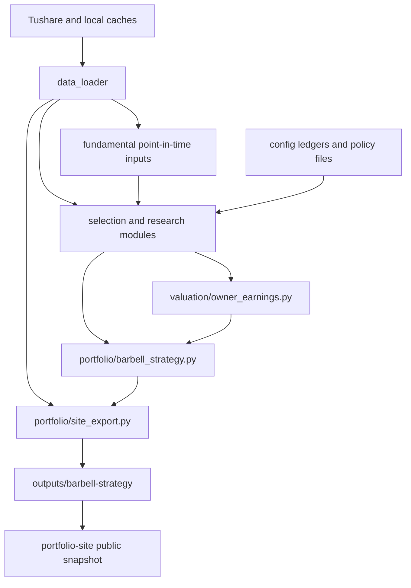

# Architecture

This document maps the current A-share Margin of Safety & Global Pricing Power pipeline rather than a future platform design. The root repository is a Python research and portfolio-accounting project. `portfolio-site/` is a separate nested website repository and is ignored by the root repository.

## Data flow

## Inputs

| Input | Current source | Used by |
| --- | --- | --- |
| Market prices and security master | Tushare client plus `data/processed/` caches | market refresh, screening, NAV and site export |
| Annual financial statements | Tushare financial loader plus local cache | point-in-time screening and owner-earnings DCF |
| Company announcements | Tushare `anns_d` plus announcement cache | moat radar; failures are reported as unavailable/partial/offline |
| Dividends and stock distributions | Tushare `dividend` endpoint plus dividend cache | forward NAV dividend ledger |
| National policy and industry mapping | `config/policy-priorities.csv`, `policy-candidate-map.csv` and policy module | research scope and future-demand candidates |
| Future thesis evidence | `future-thesis-registry.csv`, `future-evidence-ledger.csv`, `future-milestones.csv` | evidence-gated future states |
| Moat evidence | `moat-thesis-registry.csv`, `moat-evidence-ledger.csv`, `moat-human-review.csv` | moat status, review and website detail |
| Curated valuation aid | `config/valuation-repair-briefs.json` | website research aid and institution references |

The repository does not contain an LLM API client. “Local AI research aid” is a static/configuration-backed label for the generated briefs.

The pipeline keeps two analytical gates visible: owner-earnings/DCF and balance-sheet checks establish a margin-of-safety boundary; future-demand, value-capture and moat evidence test whether pricing power may be durable. The second gate is evidence-driven and not a single quantitative factor.

## Core modules

- `data_loader/` normalises Tushare access and local caches. It preserves cached data when a refresh fails instead of converting a failed request into zero.
- `fundamental/` applies point-in-time statement handling and builds survival-quality inputs.
- `selection/quant_screening.py` and related modules build the mechanical candidate pool. `policy_alignment.py` treats national policy as a research gate, not a return forecast.
- `selection/future_demand.py` scores future-demand questions and `selection/evidence_registry.py` checks dated, trusted evidence.
- `selection/moat_monitor.py` derives moat states from evidence direction and review dates. `selection/moat_radar.py` creates review alerts; it does not change the evidence ledger.
- `valuation/owner_earnings.py` calculates normalised owner earnings and five discount-rate DCF scenarios.
- `portfolio/barbell_strategy.py` classifies future states, preserves sticky anchors, applies caps and produces target weights and cash.
- `portfolio/site_export.py` combines target portfolios, forward NAV, dividend records, radar health and benchmark data into the public JSON snapshot.

## Outputs

The daily strategy writes under `outputs/barbell-strategy/` (normally ignored by Git):

- `portfolio_summary.csv` — as-of date, bucket weights and cash summary;
- `target_portfolio.csv` — next-session model target positions;
- `portfolio_nav_history.csv` — forward daily NAV and return components;
- `portfolio_dividend_ledger.csv` — entitlement, pending cash and reinvestment events;
- `moat_radar_alerts.csv` — `PENDING_REVIEW` events and suggested review actions;
- `moat_radar_health.csv` — announcement and financial coverage status;
- `portfolio.json` — site-export snapshot when the export step is run.

## Boundaries and non-goals

1. A target position is not an order. The project has no brokerage connector.
2. A close-time signal is not a same-day fill. The next-session target is the accounting boundary.
3. Human moat confirmation is informational. It does not automatically set a weight to zero or remove a stock from model NAV.
4. A radar hit is not an automatic sell. It creates a pending review and pauses further buying according to the documented workflow.
5. Public research references are curated inputs. They are not continuously fetched institutional consensus and do not automatically change trades.
6. Missing market, financial, announcement or benchmark data remains missing and is surfaced in status fields.
7. Older cycle/CPPI scripts remain in the repository for historical research. They are not the verified performance path for the current barbell strategy; see `docs/LEGACY_RESEARCH_NOTICE.md`.
